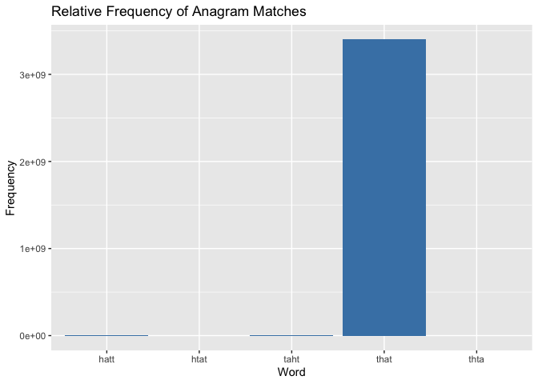

<!-- README.md is generated from README.Rmd. Please edit that file -->

# anagram

<!-- badges: start -->

[](https://github.com/Advanced-R-Programming/assignment-3-package-completion-ajen0022/actions/workflows/R-CMD-check.yaml)
<!-- badges: end -->

The “anagram” package introduces an innovative approach to anagram
detection by incorporating frequency information into its core
functionality. This feature enhances the package’s utility by providing
insights into the relative occurrence of anagrams within a corpus of
words. By considering the frequency of each word in the corpus, the
package allows users to analyze the prevalence and significance of
different anagrams, thus facilitating more nuanced linguistic
investigations.

In addition to its frequency-aware capabilities, the “anagram” package
offers essential functionalities for anagram detection within words.
Initially, it verifies whether two given words are anagrams, ensuring
they share identical letters arranged differently. Furthermore, the
package extends its capabilities to check for anagrams within a group of
words and to identify anagram subsets within a specified subset of
words, considering combinations of characters of a specified minimum
length. This versatile tool, designed for straightforward linguistic
analysis, accepts a character vector of words as input and efficiently
discerns anagram relationships, catering to various user needs.

## Installation

You can install the development version of anagram from
[GitHub](https://github.com/) with:

``` r
# install.packages("devtools")
devtools::install_github("numbats/assignment-3-package-completion-ajen0022")
```

## Example

In this example, we demonstrate the usage of the anagramfinder_function
by finding anagrams for the word “that” using the provided dictionary.
We then print and plot the output to visualize the relative frequencies
of the found anagrams.

#### Anagram Finder with Frequency Information

``` r
library(anagram)

# Call the anagramfinder_function
output <- anagramfinder_function("that", dictionary)

# Print the output
print(output)
#> Input word: that 
#> Matches found: 5 
#>        Word  Frequency
#> 10     that 3400031103
#> 68714  taht     191717
#> 107765 hatt      86981
#> 244037 thta      22068
#> 312336 htat      14109

# Plot the output
plot(output)
```



The output of the anagramfinder_function is an S3 object, a common data
structure in R. S3 objects allow for organizing data into structured
formats with associated methods for manipulation and analysis. In this
case, the anagram_output class encapsulates the results of the Anagram
Finder function, providing convenient access to the matched words and
their frequencies.

#### Check if Two Words are Anagrams

This example demonstrates how to use the are_anagrams to check if two
words are anagrams of each other. In this case, we check if the below
given examples are anagrams or not.

``` r
library(anagram)
## Check if two words are anagrams of each other
words <- c("alert", "alter", "later")
 are_anagrams(words)
#> [1] TRUE

 
 # Example 2: Checking for anagrams within subsets
 words <- c("listen", "silent", "hello", "world")
 are_anagrams(words, subsets = TRUE)
#> [1] FALSE
```

The output will be TRUE, indicating that “alert”,“alter” and “later” are
indeed anagrams of each other.

In the second example “listen and”silent” are anagrams of each other but
“hello” and “world” are not anagrams of each other that is why the
output shows FALSE.

#### Find Anagram Subsets

This example illustrates how to use the anagramsubset_function to find
anagram subsets of minimal length within a set of words. Here, we find
anagram subsets of length 3 within the words “tiger”, “right”, “tire”,
“grit”, “git”, and “rite”.

``` r
library(anagram)

## Find anagram subsets of minimal length within a set of words
words <- c("tiger", "right", "tire", "grit", "git", "rite")
min_subset_length <- 3
anagram_subsets <- anagramsubset_function(words, min_subset_length)
print(anagram_subsets)
#> [1] TRUE
```

The output will be a boolean value (TRUE in this case), indicating
whether anagram subsets meeting the specified minimum length requirement
were found within the specified set of words.

These functions provide a convenient way to work with anagrams, whether
you’re testing if words are anagrams or finding anagram subsets within a
set of words.

## Code of Conduct

Please note that this project is released with a [Contributor Code of
Conduct](link-to-your-code-of-conduct). By participating in this project
you agree to abide by its terms.
